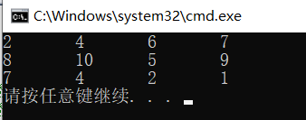
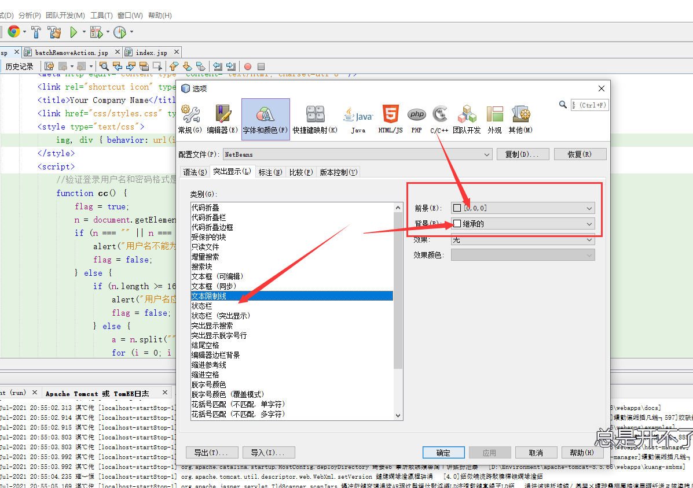
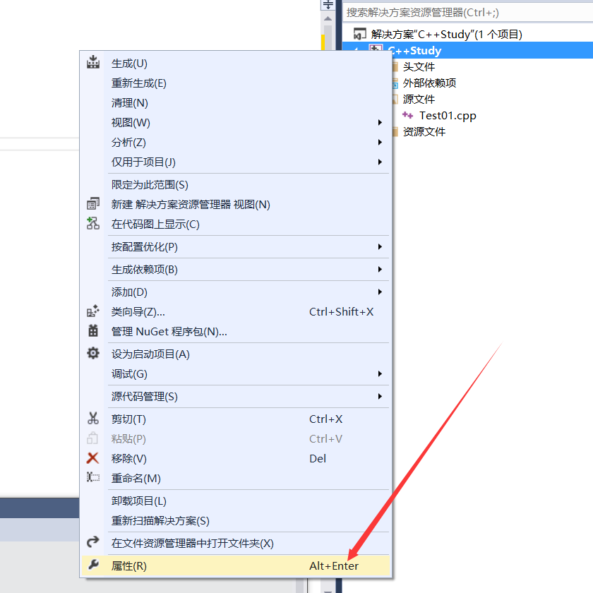
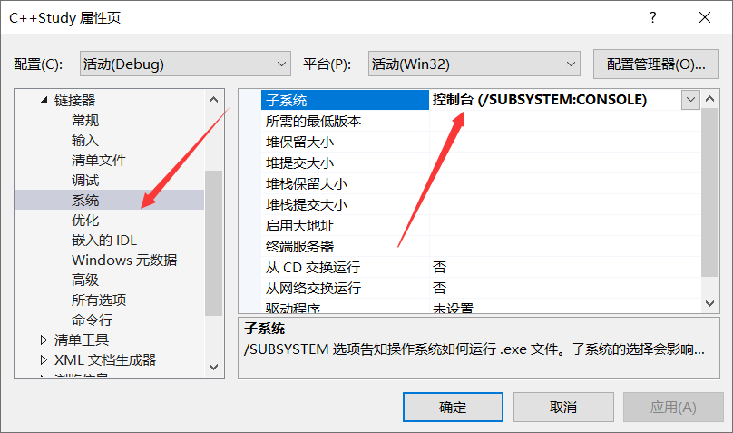

# 编程日常知识积累

## 1、Java类型

### 1.1、java里String类型如何转换成为 Int

第一种方法：i=Integer.parseInt(s);

第二种方法：i=Integer.valueOf(s).intValue();

第三种方法：Optional.ofNullable(myString)；

```java
String myString = "1234";
int foo = Integer.parseInt(myString);
```

 如果你查看[Java文档](https://docs.oracle.com/en/java/javase/12/docs/api/java.base/java/lang/Integer.html#parseInt(java.lang.String))，你会发现“捕获”是此函数可以抛出`NumberFormatException`，当然你必须处理： 

```java
int foo;
try {
    foo = Integer.parseInt(myString);
}
catch (NumberFormatException e)
{
    foo = 0;
}
```

 （此处理方式默认将格式错误的数字设置为0，但你可以根据需要执行其他操作。） 

 另外，你可以使用`IntsGuava`库中的方法，该方法与`Java` 8结合使用`Optional`，为将字符串转换为int提供了一种强大而简洁的方法： 

```java
import com.google.common.primitives.Ints;

int foo = Optional.ofNullable(myString)
    .map(Ints::tryParse)
    .orElse(0)
```

### 1.2 new User() 与 User user = null

```txt
User user=null; 声明一个变量，类型为User，不创建新实例。

User user=new User(); 声明一个变量，类型为User，同时创建一个新实例。

实际上，第一种写法也可以只写 User user;

但是这样编译器可能会出现Warning，给个null空值，编译器就不会报警了。

第二种写法创建一个新实例，是需要消耗一点点的CPU资源和内存资源的，如果你不需要一个新实例，就用第一种方法。

区别就是这样了。
```

### 1.3、集合加不加泛型的区别

```java
private void viewDetail(){
    Map map1 = new HashMap();
    Map<String,Object> map2 = new HashMap<String,Object>();
    Map<Object,Object> map3 = new HashMap<Object,Object>();
    Map<String,String> map4 = new HashMap<String,String>();
    test1(map1);
    test1(map2);
    test1(map3);	//编译错误
    test1(map4);	//编译错误
}

private void test1(Map<String,Object> map){
}

```

**在泛型这里 Object 就只表示Object 不能表示所有对象**

因为泛型是保证编译时你给的实际类型和参数声明的类型一致，它的意义就在于此，不需要解释，这是需要你学习的规则而已。

**那为什么map1就可以呢**，这里有历史原因，因为泛型是后加入的，早期的版本没有，但是java的开发者希望不能因为加入泛型就要修改成千上万的现有应用，所以默认他可以通融老版本不加泛型的变量，但是编译时一定会有提示你有危险代码的。

如果你用了泛型，就全部都用，切记切记

 jdk 1.5 以前集合是没有**泛型概念**的，所以当时的类型约束纯粹自己写,然后强转。如下 

```java
// 忽略添加map的部分.
Map map = new HashMap();
for(object obj : map){
    if(obj instanceof String){
        String str = (String) obj;
        Sysout(str);
    }
}
```

其实目前的java泛型还是用的这部分代码，只不过不用你写了，而是由编译器偷偷的在编译前替换一下再编译。

之所以这么做就是为了兼容以前不写泛型的代码，让他们也还可以正常运行。

钻石语法（属于Coin项目），这是Java7的一项改进，减少处理泛型时敲键盘的次数。
**7以前：** `Map map = new HashMap();`
**7以后：** `Map map = new HashMap<>();` 

## 2、SQL数据库类型

### 2.1、万能密码问题及解决方案

#### <font color='red'>万能密码问题：</font>

漏洞原理是:**sql运算符优先级及逻辑处理顺序--查询sql执行顺序**

  

 sql逻辑处理顺序 

  

 原验证登陆语句: 

```mysql
SELECT * FROM admin WHERE Username= '".$username."' AND Password= '".md5($password)."'
```

 输入 1′ or 1=1 or ‘1’=’1万能密码语句变为: 

```mysql
SELECT * FROM admin WHERE Username='1' OR 1=1 OR '1'='1' AND Password='EDFKGMZDFSDFDSFRRQWERRFGGG'
```

<font color='red'>and 的 优先级 or  其次1=1为真，or代表或者的意思，只要有一个条件为真，整体结果就为真。</font>

#### **<font color='cornflowerblue'>解决方法：</font>**

1. 可以再前端进行过滤操作（把 ’ 单引号过滤掉  可以使用正则表达式）

2. 也可以在后端进行过滤

   ```java
   public String replace(char searchChar, char newChar) //使用这个方法
   
   String user_name = request.getParameter("user_name");
   user_name = user_name.replace("'", "");//将单引号去掉
   String user_password = request.getParameter("user_password");
   user_password = user_password.replace("'", "");//将单引号去掉
   ```

3. 其他方式。。。。。

## 3、 C语言相关

### 3.1、二维数组使用指针方式进行遍历

1. **方法1**

```c
#include<stdio.h>
#define n 3
#define m 4
int main(){
    int i;
    int arry[3][4] = {{1,2,3,4},{5,6,7,8},{9,10,11,12}};
    int *p = (int*)arry;//这一步很关键
    for (i = 0; i < n*m; i++)
    {
        printf("%d ",p[i]);
        putchar('\n');
    }
    return 0;
}
```

```c
输出结果：
1 2 3 4 5 6 7 8 9 10 11 12 
```

2**.方法2**

```c
#include<stdio.h>
#define n 3
#define m 4
int main(){
    int i,j;
    int arry[3][4] = {{1,2,3,4},{5,6,7,8},{9,10,11,12}};
    int (*p)[4] = arry;
    for (i = 0; i < n; i++){
        for (j = 0; j < m; j++){
            printf("%d ",*(*(p+i)+j));
        }
        putchar('\n');
    }
    return 0;
}
```

```c
输出结果：
1 2 3 4 
5 6 7 8 
9 10 11 12
```

实例应用

```c
#include<stdio.h>

//指针数组和二维数组指针在定义时非常相似，只是括号的位置不同：
//纯文本复制
//int *(p1[5]);  //指针数组，可以去掉括号直接写作 int *p1[5];
//int (*p2)[5];  //二维数组指针，不能去掉括号
//访问二维数组  *(*(p+i)+j) = (*(p+i))[j]
int arr(int (*p)[4]){
    int i,j;
    for(i = 0; i < 3; i++){
        for(j = 0; j < 4; j++){
            printf("%d\t",(*(p+i))[j]);
            if(j == 3){
                printf("\n");
            }
        }
    }
    return 0;
}
void main(){
    int arr1[3][4] = {{2,4,6,7},{8,10,5,9},{7,4,2,1}};
    //调用函数
    arr(arr1);
}
```




## 4、JavaScript相关

### 4.1、标签中的href="javascript:;"是什么意思？

```html
<a href="javascript:;">我的大学</a>
```

**javascript: 是一个伪协议**

**javascript:是表示在触发默认动作时，执行一段JavaScript代码，而 javascript:; 表示什么都不执行，这样点击时就没有任何反应。**

**href="javascript:;"就是去掉a标签的默认行为，跟href="javascript:void(0)"是一样的？**

**是一样的。**

**void 是JavaScript 的一个运算符，void(0)就是什么都不做的意思。**

## 5、编译器问题

#### 5.1、NetBeans

##### 1、NetBeans去除红色限制线

点击 工具 --> 选项 --> 字体和颜色 --> 文本限制线

前景选定制 RGB颜色全为 0 背景选 继承的



##### 2、Tomcat部署失败

将代理设置为无代理即可


#### 5.2、VS2013

##### 1、VS 2013程序点击Ctrl+F5执行出现执行窗口闪退现象的解决方法

 用VS2013建立一个C++空项目的时候会出现执行窗口闪退的现象，百度一下找到解决方案 

 1.首先，右击解决方案下项目名称，选择属性 

  

 2.在链接器--->系统中找到子系统，将子系统选择成控制台， 



3.然后点击Ctrl+F5,就可以运行了

备注：

如果刚开始就建立了win32控制台程序，那子系统中就会自动是控制台了