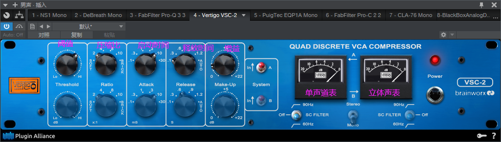
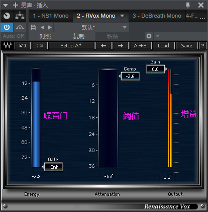
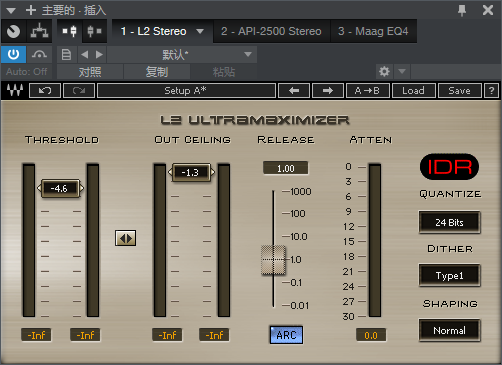
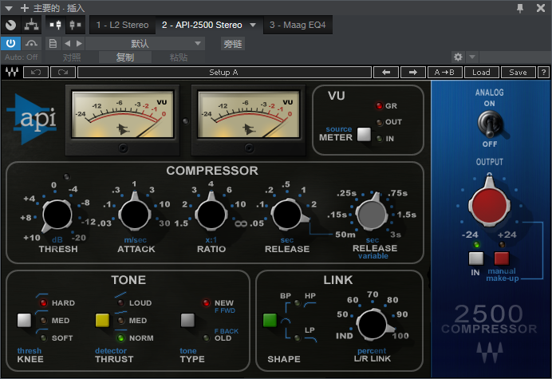
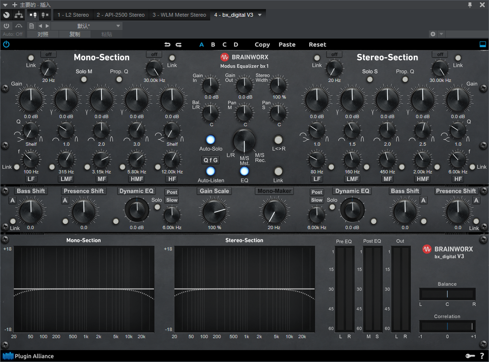
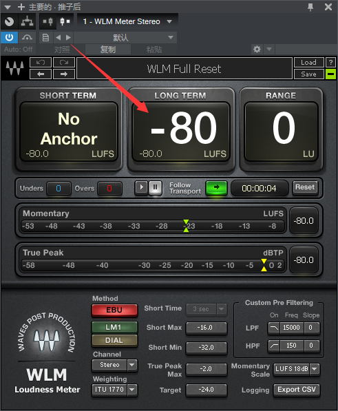

# 贴唱混音

## 大致学习

### 1.人声和伴奏融合度

侧链eq

### 2.自动化EQ(潜入水底的感觉)

水底:用肥波Q2从高频到低频

浮出水面：用肥波Q2从低频到高频

### 3.简单母带

1. 声场

   臭氧的imager

2. 响度

   限制器waves的L3限制器

   out client 调到-0.5

   threshold 根据各区情况判断调节

## 音频修复处理

### 1.降噪

### 2.呼吸声处理

## 系统学习

#### 1.EQ学习

首先先用数字EQ（比如肥波Q3）把不好的频点衰减3db左右  

同时3000hz左右做个增益 可以是人声更加清晰和突出 

然后再使用模拟EQ进行一定的增益，人声塑造（比如Waves里的PuigTec EQP1A  ）

BOOST是增加  ATTEN是衰减  BANDWIDTH是Q值  这个效果器里 低频既有衰减也有增益  中低频只有增益  高频只有衰减 

中低频提升是为了提升一种色彩感   高频衰减是减少毛刺声

**EQ的人声基本调节**  

**1、对男歌手的音色频率调节  男声基音频率在64-523Hz左右，泛音可扩展到7-9kHz。  要求男歌手的声音要坚实，音色要有力度，但又不至于造成模糊不清。因此，对男歌手音色频率调节要求在4个频率段进行处理 根据男声的泛音结构，依频谱曲线为据，对男歌手在4个频率段进行加工处理的手法是：**  

（1）对**64-100Hz**做小的提升，其目的是为了增加一些浑厚感``也是男低音的音域；  （2）在**250-330Hz**做大的提升，因为男声基音的主要频率在这个区域，提升此频段可增加基音的力度；  （3）对**1kHz**左右频段做小的提升，这样可保证泛音的频率表现，增加音色的明亮度。这个频段可延续至**3-8KHz**；  （4）**10kHz**以上频段可做平直处理。 

**2、对女歌手的音色频率调节  女声基音频率在160Hz-1.2kHz左右，泛音可扩展到9-10kHz。因此，要使女声得到最佳音色表现，应在4个频率上进行处理 女声音色表现为圆润、清晰、明亮。  女声歌手的4个频率加工处理的手法是：**  

（1）**160Hz**以上，频率低于女声音域，不做提升处理；  （2）**250-523Hz**音区是女声主要音域，做提升处理，以增加基音的力度和丰满度，是女声的低中音区；  （3）对**1-3kHz**频段进行提升，其目的是为了使音色结构的泛音表现出良好的频率导通特性，使音色更加完美，同时可增加音色的明亮度；  （4）**10kHz**以上频率给予小的提升，目的是为了使音色的色彩有足够的表现力。可对音色微小、细腻的部分加以表现。

 **3、对鼻音严重的音色处理  鼻音产生的原因有2个：一是生理上的原因，生理机体有缺陷；二是发声方法或者训练方法不正确，而造成鼻腔共鸣过强。**  

改善鼻音严重和方法应在四频段均衡器上进行频率处理  （1）对**64-100Hz**频段进行大的衰减，以消除鼻音严重频带；  （2）对**100-200Hz**进行衰减，以消除鼻音哼声；  （3）**250-330Hz**频段略做提升，以增加语音的力度；  （4）**3.3kHz**左右频段做较大的提升，以增加音色的明亮度、清晰度，  （5）对**10kHz**频段做小的提升，为的是加强高频泛音的频带表现。  对音色和处理应切掉低音频率，这样就相应地增加了音色的清晰度。如果在**3KHz**频段做较大的提升，也可明显地提高声音的明亮度和清晰度。  

**4、对歌手音域较窄的音色处理  有些没有经过训练的女歌手，其音色在高音区域范围很窄，声音单薄、刺耳，音色缺乏深度感。因此，对声带窄的业余女声演唱者可用四段均衡器进行音色处理 对其音色处理着重于音色改善，提升基音区频率，以增加音色厚度；衰减中高音**
区频率，以消除高频噪声。具体处理方法如下：  （1）**250-330Hz**频段应予最大的提升，其目的是提升基音区频率，增加音色的浑厚度；  （2）**1KHz**频段则不提升，以减小音色刺耳的中高频成分；  （3）**4KHz**频段左右应进行较大的衰减，目的是消除尖噪的高频噪声；  （4）对**10KHz**频段进行最大的衰减，消除由于声带音色不纯净而产生的高频噪声。  对业余歌手的音色改善应以明亮而不刺耳、圆润而不纯净而产生的高频噪声。 5、对童声音色的频率处理  童声不分男声女声，与女声歌手音域基本一致。这时因为童声音域的频带与女声音域的频带相似，所以其调音的方法也和女声歌手的调音方法相仿。  

#### 2.压缩器(人声压缩推荐用模拟压缩)

 和均衡器一样也是分为 数字压缩  和  模拟压缩 

压缩比越小 越硬  越硬越适合说唱 

**数字压缩**

推荐使用肥波的C2，可视效果好

首先先将 阈值 （-8） 和  压缩比调的很大（8:1）

因为再这种情况下，很容易听出差别   然后在调节启动和释放时间

(启动时间要听声音是否能放得开，释放时间看是表跳动的是否有活力 并且 可以归零 )

调完后，去调节压缩比和阈值  显示在-4以内   

最后调节Gain  调到开不开效果器的音量差不多就ok了

总结:**看表(看表的转速 )  加 听觉**

**模拟压缩**

使用的是插件联盟 里的Vertigo VSC-2

使用方法和上面的数字压缩类似，思路是一样的

也可以使用Waves里的CLA-76(不过要注意这里的启动和释放时间都是反着的)

**压缩链**

  就是使用两个或者多个不同的压缩效果器

这里使用的是waves的Rvox 和 插件联盟 里的Vertigo VSC-2  这两个压缩效果器的组合

RVox的作用主要是增大声音小的地方，限制声音大的地方  起到平衡音量的作用

RVox一般只用调节 阈值 和 Gain 就行了

这一步做完，基本人声平衡了

然后再用Vertigo VSC-2进行压缩

#### 3.混响学习

注意：好的混响不是调出来的，而是挑出来的（挑预设，然后调整Pre Delay 和 Reverb Time）

##### 3.1混响时间计算

**大厅混响：**

​	Pre Delay：60/BPM/8（16）  取结果前两位非零数字

​	Reverb Time：60/BPM*3（4）

**板式混响：**

​	Pre Delay：60/BPM/16（32）  取结果前两位非零数字

​	Reverb Time：60/BPM*3（4）

**房间混响：**

​	Pre Delay：60/BPM/32  取结果前两位非零数字

​	Reverb Time：60/BPM*1（2）

##### 3.2混响使用

**一般的歌曲一个板式混响完全够用**

一般先加一个DeEsser来去除人声齿音频段

再加混响插件

最后再来做个Eq高低切

#### 4.延迟处理

记得给Delay也一定要发送一定的混响

PingPong慎用

#### 5.齿音处理

用肥波的DS

PAZ可以测试出齿音 频段

#### 6.自动化处理

#### 7.总线处理

限制器  Waves里的L2

总线压缩一定要小   控制再2db以内  很轻微的压缩

太多的话会破坏空间感   变干

同时也可以轻微的做下EQ

最后可以再总线最后添加一个Waves的WLM用来测试响度

一般中间的值  到达 -10  到 -8 左右即可

响度和音量是两码事

记得导出时关闭这个WLM插件

不建议用臭氧的一键自动母带

